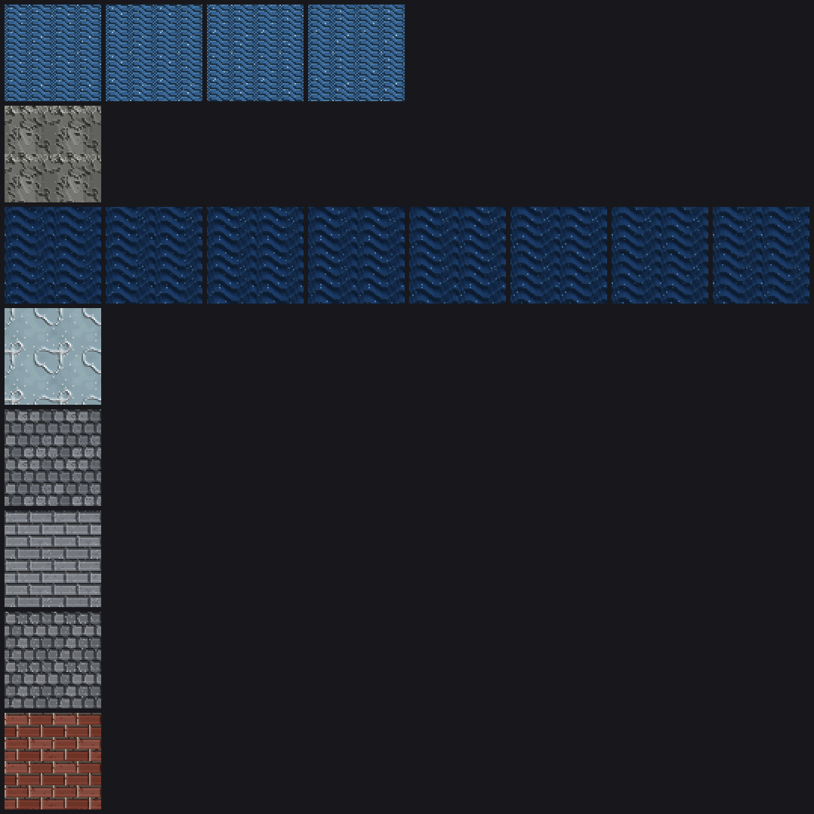

# Authoring tile art

The tileset ships 22 tiles, each with 32×32 pixel art on all six cube faces.
The art is **generated from code**, not hand-drawn pixel data: painters live in
`src/world/tiles/art/`, the catalog lives in `src/world/tiles/defaultTiles.ts`,
and `data/tileset.json` is a baked copy of that catalog.


## The model in one paragraph

A face is a `FacePixels` array — one color (or `null` for "use the tile's flat
color", which is see-through when that flat color is transparent) per pixel. A **painter** is `(x, y) => string | null`. `paintedFace`
runs a painter over the grid, `stackedPainters` layers painters so later ones
paint over earlier ones wherever they return a color, and `cubeArtFrom` builds
all six faces from a top / sides / bottom painter. Every painter must be a pure
function of its pixel coordinates and a fixed seed — the same rule the procgen
nodes follow — so `npm run check` can assert the art regenerates identically.

Each face can carry two more things: a **relief layer** and **frames**.

## Relief: greyscale in, normal map out

Relief is a second grid painted over the same pixels, in greyscale: light is
high, dark is low, `#808080` and unpainted pixels are flat. `faceArtHeight`
converts between a height in 0..1 and its ink; the 3D view runs the field
through `normalTextureFromHeights` — a wrapping Sobel, so relief tiles as
seamlessly as the colors do — and hands the result to the material as a normal
map. Nothing about the geometry changes; the light just catches the bumps.

Pass relief as the third argument to `cubeArtFrom`, painting only the faces that
have any:

```ts
cubeArtFrom(SIZE, { top, sides, bottom }, { top: crackPainter([heightInk(0.28)], …) })
```

A face whose relief is entirely flat never builds a normal map at all, so
leaving it out costs nothing.

## Animation: frames that close the loop

`animatedCubeArt(size, frames, frameMs)` builds art that cycles. Frame 0 must
paint every face; **later frames paint only the faces that change**, and any
face they leave out is read back from frame 0. That is what keeps the baked
`data/tileset.json` from multiplying by the frame count, and it lets the
renderer draw a still face once instead of once per frame (`faceArtPlan`).

Two rules make an animation usable as a tile:

- **Every frame must tile in space**, exactly as a still would.
- **The loop must close in time**: the frame after the last must be the first
  again. The water does this by scrolling its wave bands one pixel per frame for
  exactly `bandHeight` frames, at which point the band pattern lands back on
  itself. `npm run check` asserts both properties for the shipped waves.

Only the surface of the water moves — the submerged sides and the bottom are
painted once, on frame 0.



## Making art tile seamlessly

The 3D view repeats a face across neighbouring cells, so patterns must wrap at
32 pixels:

- `patchNoise` / `twoOctavePatchNoise` wrap their lattice, so use them (not raw
  `Math.sin` over unbounded coordinates) for clumps, cracks and blobs.
- Masonry, plank and wave periods must divide 32 — 4, 8 or 16 — and a stagger
  must return to zero after a full 32 pixels (`courseHeight 8, stagger 8`).
- `pixelNoise` is per-pixel, so it is seamless by construction.

## The painter toolkit

| Painter | Used for |
| --- | --- |
| `grainPainter`, `patchPainter`, `specklePainter`, `clusteredSpecklePainter` | speckled soil, sand, gravel, clumped foliage |
| `brickworkPainter` | cobbles, flagstones, brick and stone walls, pebbles |
| `plankPainter` | decks, bridges, wooden floors |
| `wavePainter`, `crestPainter`, `waveHeightPainter` | water surfaces, dune ripples, plough furrows |
| `crackPainter` | rock fractures, ice cracks, glowing lava veins |
| `brickReliefPainter` | the raised courses and sunken mortar of anything masonry |
| `soilSidePainter` | the earth cross-section on the sides of floor tiles |

`colorMath` (`lighten`, `darken`, `mixHex`, `shadedRamp`) keeps palettes to one
hue with derived shades, which is what makes the set read as one tileset.

The editor exposes the same three things: **colour / relief** tabs above the
canvas, a frame strip with a play button below it, and the 3×3 tiling preview
that runs the animation while it plays.

## Adding a tile

1. Write a `…FaceArt(): CubeFaceArt` function in the family file it belongs to
   (`waterTileArt`, `groundTileArt`, `vegetationTileArt`, `stoneworkTileArt`,
   `builtTileArt`), building on the painters above. Floor tiles get
   `groundCubeArt`; blocks and trees get `cubeArtFrom`.
2. Append an entry to `TILE_CATALOG` in `defaultTiles.ts`. Append only —
   catalog order defines tile ids, and saved pipelines reference tiles by id.
   The first five ids must stay water, sand, grass, tree, rock.
3. `npm run tiles:preview` writes `docs/tileset-preview.png`; each tile is
   shown as a 2×2 repeat of its top face (so seams are visible) beside its
   north face.
4. `npm run tiles:relief` writes `docs/relief-and-motion-preview.png`: every tile
   that has relief or frames, tiled 2×2 and lit by a low sun through its own
   height field, one panel per frame. It is the quickest way to see whether
   relief reads and whether an animation loops without a jolt.
5. `npm run tiles:write` bakes the catalog into `data/tileset.json`.
6. `npm run check` verifies every tile has non-blank, valid 32px art, unique
   names/symbols/ids, the reserved role ids, and deterministic generation.

## How the shapes read in 3D

`tilePlacements` decides a tile's shape from its role and walkability: the
`water` role sinks into a floor slab, the `tree` role becomes a cone textured
with the north face, anything non-walkable stands as a full block (top + four
sides + bottom all visible), and everything else is a floor slab where only the
top face is normally seen. Paint accordingly: walls deserve real side art,
floors deserve a convincing cross-section, trees only need a good side face.

Volumes shorter than a full cube do not squash their art. `tileBoxGeometry`
gives every face a UV window the size of the face, so a floor slab a tenth of a
tile tall shows the top tenth of its side art at the same pixel scale as a full
block, rather than the whole cross-section crushed into a stripe. Paint side art
for a floor from the top down: the first few rows are all that will be seen.
