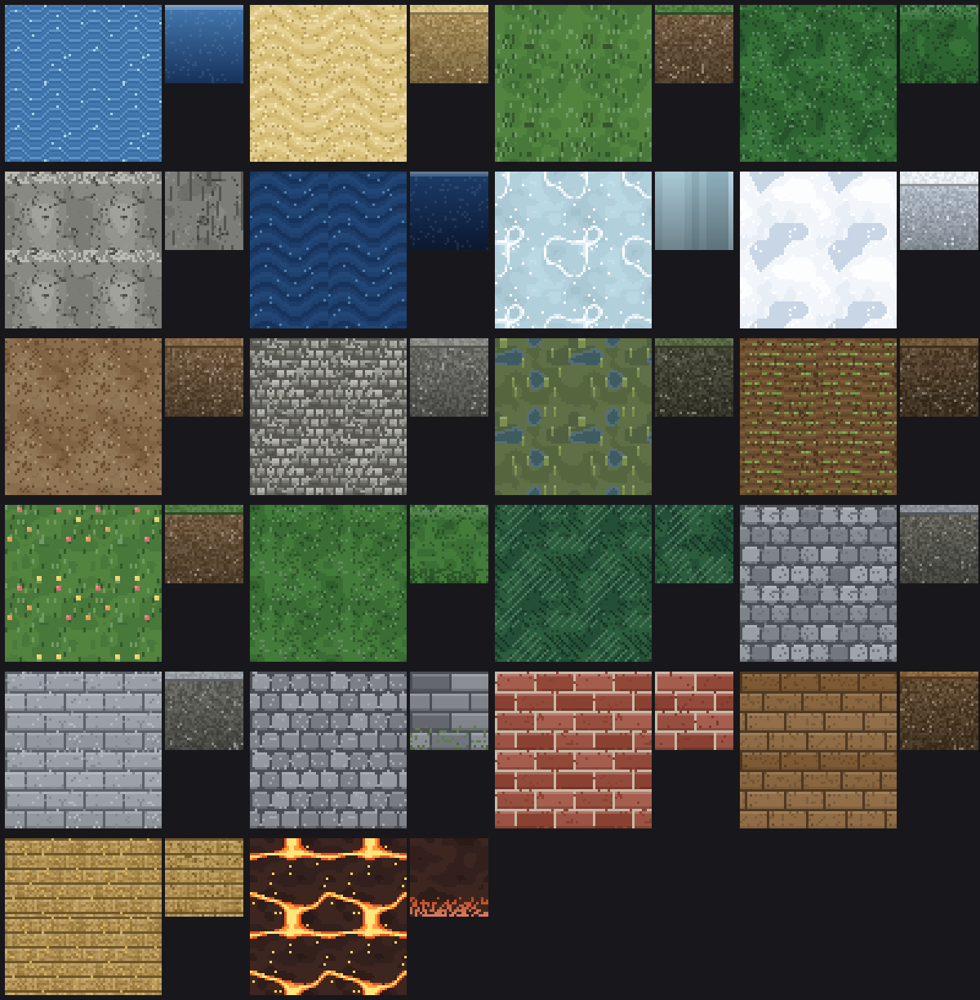

# Authoring tile art

The tileset ships 22 tiles, each with 32×32 pixel art on all six cube faces.
The art is **generated from code**, not hand-drawn pixel data: painters live in
`src/world/tiles/art/`, the catalog lives in `src/world/tiles/defaultTiles.ts`,
and `data/tileset.json` is a baked copy of that catalog.

## The model in one paragraph

A face is a `FacePixels` array — one color (or `null` for "use the tile's flat
color", which is see-through when that flat color is transparent) per pixel. A **painter** is `(x, y) => string | null`. `paintedFace`
runs a painter over the grid, `stackedPainters` layers painters so later ones
paint over earlier ones wherever they return a color, and `cubeArtFrom` builds
all six faces from a top / sides / bottom painter. Every painter must be a pure
function of its pixel coordinates and a fixed seed — the same rule the procgen
nodes follow — so `npm run check` can assert the art regenerates identically.

## Making art tile seamlessly

The 3D view repeats a face across neighbouring cells, so patterns must wrap at
32 pixels:

- `patchNoise` / `twoOctavePatchNoise` wrap their lattice, so use them (not raw
  `Math.sin` over unbounded coordinates) for clumps, cracks and blobs.
- Masonry, plank and wave periods must divide 32 — 4, 8 or 16 — and a stagger
  must return to zero after a full 32 pixels (`courseHeight 8, stagger 8`).
- `pixelNoise` is per-pixel, so it is seamless by construction.

## The painter toolkit

| Painter | Used for |
| --- | --- |
| `grainPainter`, `patchPainter`, `specklePainter`, `clusteredSpecklePainter` | speckled soil, sand, gravel, clumped foliage |
| `brickworkPainter` | cobbles, flagstones, brick and stone walls, pebbles |
| `plankPainter` | decks, bridges, wooden floors |
| `wavePainter`, `crestPainter` | water surfaces, dune ripples, plough furrows |
| `crackPainter` | rock fractures, ice cracks, glowing lava veins |
| `soilSidePainter` | the earth cross-section on the sides of floor tiles |

`colorMath` (`lighten`, `darken`, `mixHex`, `shadedRamp`) keeps palettes to one
hue with derived shades, which is what makes the set read as one tileset.

## Adding a tile

1. Write a `…FaceArt(): CubeFaceArt` function in the family file it belongs to
   (`waterTileArt`, `groundTileArt`, `vegetationTileArt`, `stoneworkTileArt`,
   `builtTileArt`), building on the painters above. Floor tiles get
   `groundCubeArt`; blocks and trees get `cubeArtFrom`.
2. Append an entry to `TILE_CATALOG` in `defaultTiles.ts`. Append only —
   catalog order defines tile ids, and saved pipelines reference tiles by id.
   The first five ids must stay water, sand, grass, tree, rock.
3. `npm run tiles:preview` writes `docs/tileset-preview.png`; each tile is
   shown as a 2×2 repeat of its top face (so seams are visible) beside its
   north face.
4. `npm run tiles:write` bakes the catalog into `data/tileset.json`.
5. `npm run check` verifies every tile has non-blank, valid 32px art, unique
   names/symbols/ids, the reserved role ids, and deterministic generation.

## How the shapes read in 3D

`tilePlacements` decides a tile's shape from its role and walkability: the
`water` role sinks into a floor slab, the `tree` role becomes a cone textured
with the north face, anything non-walkable stands as a full block (top + four
sides + bottom all visible), and everything else is a floor slab where only the
top face is normally seen. Paint accordingly: walls deserve real side art,
floors deserve a convincing cross-section, trees only need a good side face.

How tall a tile stands is the tile's own `height`, in tiles. Blocking tiles
default to 2 — a character is 2 tall, so anything that stops them is something
they cannot see over — and walkable tiles are 1 whatever the field says, since
they are drawn flat. The shipped exceptions are the pools (water, deep water,
lava), which block movement at height 1. A block is drawn as `height` stacked
cubes so the side art repeats per tile instead of stretching; a tree is one cone
scaled to `height`, which is why trees carry fractional heights (2.6 for the
broadleaf, 3.2 for the pine) and blocks do not.
